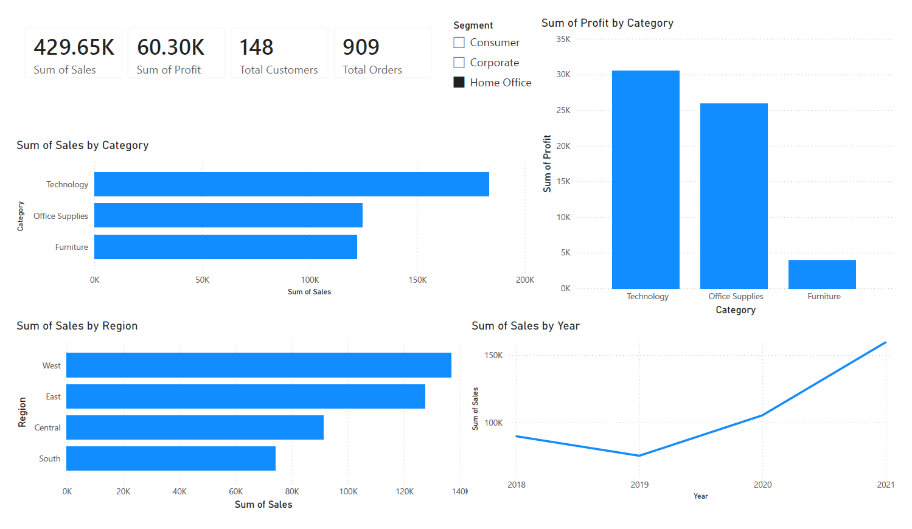
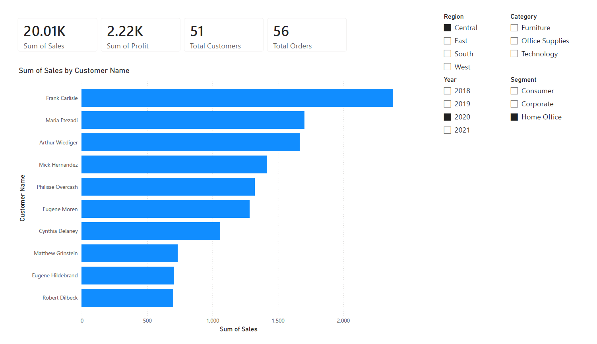
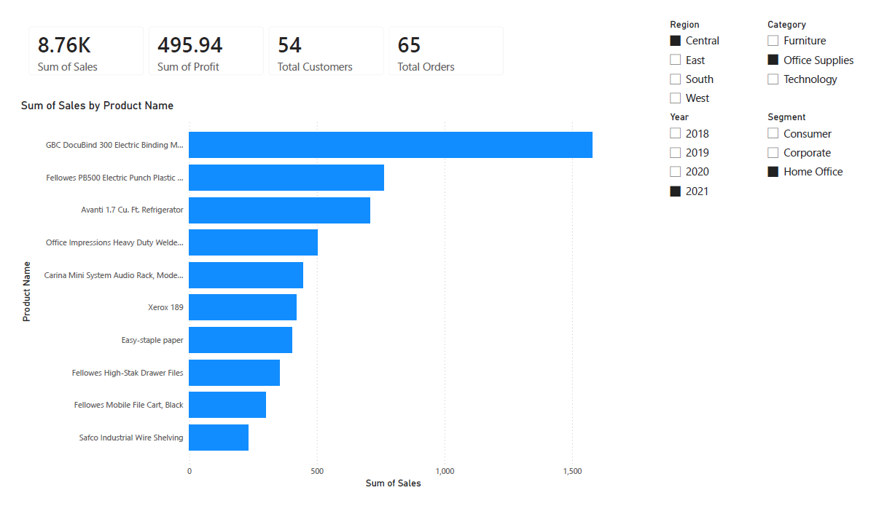

## Power BI Dashboard

To complement the Python-based analysis, interactive dashboards were created in Power BI for business users and decision-makers.

### Dashboard 1: Sales Overview

Features:

* Sales KPI Tracking
* Profit KPI Tracking
* Customer Metrics
* Order Metrics
* Sales by Category
* Profit by Category
* Regional Sales Analysis
* Yearly Sales Trends
* Segment-Level Filtering

### Dashboard 2: Customer Analysis

Features:

* Top Customers by Sales
* Customer Performance Metrics
* Region-Based Analysis
* Segment-Based Analysis
* Category-Based Analysis
* Interactive Drill-Down Filtering

### Dashboard 3: Product Analysis

Features:

* Top Selling Products
* Product Performance Tracking
* Category Analysis
* Regional Filtering
* Year-Based Performance Monitoring

### Business Value

The dashboards enable stakeholders to:

* Monitor sales performance in real time
* Identify profitable categories and products
* Track customer behavior
* Compare regional performance
* Support strategic business decisions through interactive reporting
